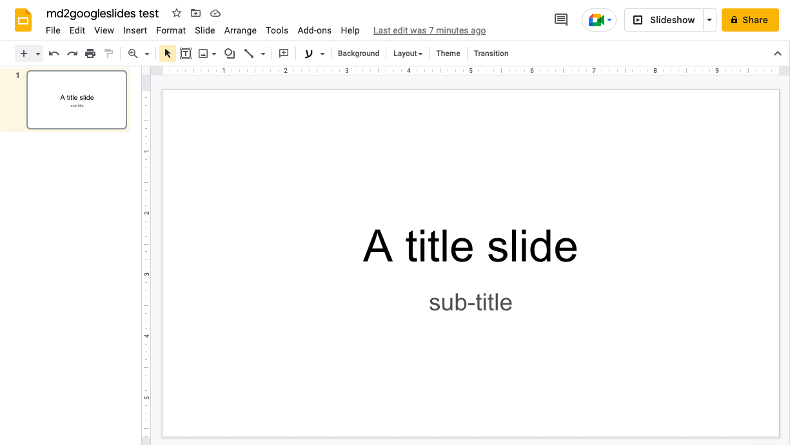

## Presentations

Presentations. This is a standard way of conveying information to a bunch of people in a meeting or in a class. There have been some cases where I've seen *truly different* way of presenting (things like [prezi](https://prezi.com/)), but usually, it's a PowerPoint or a Google Slides presentation which is presented. 

## I dislike designing presentations

The design aspect of a presentation has always been something that I disliked. I like to focus on the **idea** I'm trying to convey - not on how to position the bullets and format the text. That's why when I've seen [deckset](https://www.deckset.com/), I was immediately hooked. It works so well. You focus on the idea by writing markdown syntax - and you get so many beautiful designs with a few clicks. When using deckset, I'm also able to use any text editor I want, which is also nice (I like the open source [MacDown](https://macdown.uranusjr.com/) editor).

## What about interacting and permissions?

I'm currently working at Meta, where we're using (mostly) Google Slides to write and present presentations. When using Deckset (and not Google Slides), the best sharing option I have is to export the presentation into a PDF and share it as a file. From the author's perspective, Google slides' sharing flow is much easier and allows finer granularity of permissions. From the reader's perspective, consuming the presentation in PDF format has friction. How to comment? How to view it on mobile? 'Really? I need to download the presentation in order to view it? WTF?'.

I want to be able to write slides in markdown (just like when using Deckset), but use Google Slide's sharing, viewing and commenting flow.

## md2googleslides

[md2googleslides](https://github.com/googleworkspace/md2googleslides) is an open-source tool which provides the ability to translate a markdown file into a Google Slides presentation, according to some format. It's even mentioned in the [Google Slides API page](https://developers.google.com/slides/api/samples) as an a reference. The project, however, isn't very active and the authentication flow does require some source-code editing to get it to work. See [this github issue](https://github.com/googleworkspace/md2googleslides/issues/170) for the issue and a workaround.

But after working around the authentication issue, I was able to get the initial sync to work: 
```lang=bash
$ cat ${HOME}/tmp/md2googleslides_test.md
---

# A title slide

## sub-title
```
And then: 
```lang=bash
$ ${HOME}/node_modules/md2gslides/bin/md2gslides.js \
  ${HOME}/tmp/md2googleslides_test.md --title "md2googleslides test"
...
...
Opening your presentation (https://docs.google.com/presentation/d/SOME_ID)
```

Gets this:



This command creates a new presentation for every invocation. The documentation helps with this: 

>  To reuse deck available at: `https://docs.google.com/presentation/d/<some id>/edit#`
> 
> `md2gslides slides.md --title "Talk Title" --append <some id> --erase`

I also didn't want to keep having the presentation be re-opened, so I also added the `--no-browser` option. So eventually, I got to a point I was running the following command for testing the markdown to Google slides sync:
```lang=bash
$ ${HOME}/node_modules/md2gslides/bin/md2gslides.js \
  --title "md2googleslides test" --append SOME_ID --erase --no-browser \
  ${HOME}/tmp/md2googleslides_test.md
```

## Auto-resync using entr

I wanted to have some mechanism which would be able to trigger a sync to Google Slides using that command whenever the markdown file has been changed. First, I thought about writing it myself. Then, I realized that I'd probably have too many bugs if I did - so I searched to see if something like this already exists. Surely enough - there is. I found [entr](https://github.com/eradman/entr) which allows to run arbitrary commands when a file (or files) change(s). Sweet. 

Modifying the command for `entr` got me this: 
```lang=bash
$ echo ${HOME}/tmp/md2googleslides_test.md | \
  entr $HOME/node_modules/md2gslides/bin/md2gslides.js \
  --title "md2googleslides test" --append SOME_ID --erase --no-browser \
  ${HOME}/tmp/md2googleslides_test.md
```

Then, it looks something like this:
1. Edit the markdown file
2. Save the markdown file
3. `entr` picks up the changes and invokes `md2googleslides`
4. The new slide appears in the presentation
5. Profit!




## Not production ready, unfortunately

Unfortunately, I don't see myself really using this setup for writing slides. First, which I could have dismissed if it was for my own personal usage, is because I needed to do a few workarounds to get this to work properly. I got a few red security-related banners from Google when accepting the OAuth token I created for this. Second is performance. Compared to using deckset where the update of the slide upon save is instantaneous, in md2googleslides it does take a few seconds for a presentation to sync. I guess that starting the node server it part of the problem and potentially - md2googleslides could be run as a server, but seems like an overkill.

