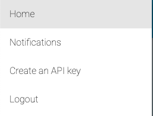
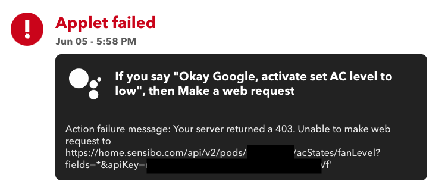

In this post I'd like to share how I used [IFTTT](https://ifttt.com/) and [Sensibo](https://sensibo.com/) to overcome a missing functionality in Google Assistant. 

## What I have

I own a [Sensibo Sky](https://sensibo.com/products/sensibo-sky) which allows me to control my living room's air conditioner unit. I also own a Google Home Mini which allows me to trigger actions on my Google Home devices using voice commands.

Sensibo's products integrate with Google Home, which means I can use voice commands to [perform several actions](https://support.sensibo.com/l/en/article/wopsotkhmr-google-home) on my air conditioning unit. 

## What I was missing

I wanted to have the ability to change the fan's speed using voice commands. I couldn't find an example of such a phrase in the documentation, so I contacted Sensibo's support. They confirmed that there's no support for such a phrase. 

## Identifying the building blocks

I posted in a home automation Facebook group if someone knows how to do this, and [Itay](https://www.linkedin.com/in/itay-levy-b9b342a/) reached out and suggested that I'd use [IFTTT](https://ifttt.com) to get it done. He also sent me [Sensibo's API page](https://sensibo.github.io/) - which has the API to change the fan speed. 

For the 'if' in IFTTT, IFTTT supports [Google assistant](https://ifttt.com/google_assistant_v2). This means I could use a voice command on my Google home devices (like my Google home mini) to trigger an IFTTT command. 

For the 'that' in IFTTT, IFTTT supports [web-hooks action type](https://ifttt.com/maker_webhooks/actions/make_web_request). This means I could perform an HTTP call using IFTTT. Specifically, I could call Sensibo's API.

## Shell-first

I started with the action. I wanted to get to a point where I can run a curl command which changes the fan's speed. 

Getting a Sensibo API key was relatively easy. Under the menu in `https://home.sensibo.com/` I could find how to create an API key:



Then, I started crafting the API call. First, I needed a way to get my Sensibo device's ID. That was easy, as there's an example of that exact command in the [documentation's examples](https://sensibo.github.io/#overview):

```
curl -X GET 'https://home.sensibo.com/api/v2/users/me/pods?fields=*&apiKey={api_key}'
``` 

This spills out all the information about your devices. You can specify the `id` field in the query to get only the device id:

```
curl -X GET 'https://home.sensibo.com/api/v2/users/me/pods?fields=id&apiKey={api_key}'
```

Which gets something like this:

```
{"status": "success", "result": [{"id": "XXXXXX"}]}
```

Then, I used the '[change only one property of the AC state](https://sensibo.github.io/#patch-/pods/-device_id-/acStates/-property-)' API call to change the fan speed:

```
curl -X PATCH 'https://home.sensibo.com/api/v2/pods/{device_id}/acStates/fanLevel?apiKey={api_key}' -d '{"newValue": "low"}
```

I toggled between `"low"` and `"medium"` to change the state. When hearing the air conditioning unit beep - I knew that I was on the right path. Looking at Sensibo mobile app confirmed that the state has been changed. 

At this point, I called my daughter (who was watching TV). I asked her if she wants to see something cool. I showed her my shell, and told her that I'm going to change the AC state by pressing a button. When hitting 'return' and hearing the beep, her eyes opened wide open. After a few seconds, she went back to watching TV.

## Using IFTTT to hook everything together

I connected my IFTT account to Google Assistant, and created a new applet.
First, I defined a 'Set AC level to low' scene as the 'if'. Then, I defined a 'make a web request' as the 'then'. I crafted the URL based on the curl request, specified `PATCH` as the method, chose `application/json` as the content type and set `{"newValue": "low"}` as the body. 

Then, I want to the living room, called 'hey Google, activate set AC level to low'. Google confirmed with success, but nothing happened. Turns out that IFTTT allows to see the logs of the latest invocations of the applet:



I had a copy-paste error. I copied the curl command's apostrophe. Facepalm. I removed that, and it worked!



In the video, you can:
1. See that Google home was able to trigger the scene
2. See that the Sensibo Sky sends the command (by flashing the blue light)
3. The air conditioning unit beeps when receiving the status update command

I then created a similar applet for setting the AC level to 'medium'.

## What I didn't want to use

IFTTT has a [Sensibo integration](https://ifttt.com/sensibo), which simplifies how to do perform basic actions. But, those actions require you to set multiple states of the AC. I assume that it's using [this](https://sensibo.github.io/#post-/pods/-device_id-/acStates) API call. I wanted to keep all other states, but change the fan level.

