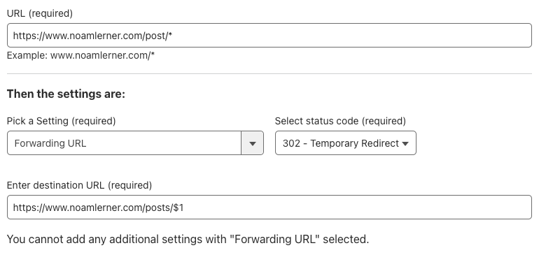

A few weeks ago, I changed the blog's design. I moved it from using the
[binario theme](https://github.com/Vimux/Binario) theme to [congo
theme](https://github.com/jpanther/congo). This was made for several reasons,
but the biggest one was to allow multi-language content. 

However, during the move, I had to move the URL paths from `/post` to `/posts`.
This broke existing URLs. 

Turns out that it's possible to fix this at the http level, when using
[cloudflare pages](https://developers.cloudflare.com/rules/page-rules/). 

Therefore, I was able to define the following: 

URL:
```
https://www.noamlerner.com/post/*
```

Define a `Forward URL` as `302` (to avoid permanent errors while testing)

Specified the destination URL to be: 
```
https://www.noamlerner.com/posts/$1
```

The `$1` specifies the matched string form the original URL.

Here's a screenshot: 


After enabling the rule, I get a 302: 
```
0|[noamler@noamler-mbp]:~$ curl -v https://www.noamlerner.com/post/
*   Trying [2606:4700:3037::6815:38aa]:443...
* Connected to www.noamlerner.com (2606:4700:3037::6815:38aa) port 443
* ALPN: curl offers h2,http/1.1
* (304) (OUT), TLS handshake, Client hello (1):
*  CAfile: /etc/ssl/cert.pem
*  CApath: none
* (304) (IN), TLS handshake, Server hello (2):
* (304) (IN), TLS handshake, Unknown (8):
* (304) (IN), TLS handshake, Certificate (11):
* (304) (IN), TLS handshake, CERT verify (15):
* (304) (IN), TLS handshake, Finished (20):
* (304) (OUT), TLS handshake, Finished (20):
* SSL connection using TLSv1.3 / AEAD-CHACHA20-POLY1305-SHA256
* ALPN: server accepted h2
* Server certificate:
*  subject: CN=www.noamlerner.com
*  start date: Apr 13 15:39:52 2024 GMT
*  expire date: Jul 12 15:39:51 2024 GMT
*  subjectAltName: host "www.noamlerner.com" matched cert's "www.noamlerner.com"
*  issuer: C=US; O=Let's Encrypt; CN=E1
*  SSL certificate verify ok.
* using HTTP/2
* [HTTP/2] [1] OPENED stream for https://www.noamlerner.com/post/
* [HTTP/2] [1] [:method: GET]
* [HTTP/2] [1] [:scheme: https]
* [HTTP/2] [1] [:authority: www.noamlerner.com]
* [HTTP/2] [1] [:path: /post/]
* [HTTP/2] [1] [user-agent: curl/8.4.0]
* [HTTP/2] [1] [accept: */*]
> GET /post/ HTTP/2
> Host: www.noamlerner.com
> User-Agent: curl/8.4.0
> Accept: */*
>
< HTTP/2 302
< date: Tue, 07 May 2024 11:37:49 GMT
< content-type: text/html
< content-length: 143
< location: https://www.noamlerner.com/posts/
< cache-control: private, max-age=0, no-store, no-cache, must-revalidate, post-check=0, pre-check=0
< expires: Thu, 01 Jan 1970 00:00:01 GMT
< nel: {"success_fraction":0,"report_to":"cf-nel","max_age":604800}
< server: cloudflare
< cf-ray: 8800eb92fd98634c-LHR
< alt-svc: h3=":443"; ma=86400
<
<html>
<head><title>302 Found</title></head>
<body>
<center><h1>302 Found</h1></center>
<hr><center>cloudflare</center>
</body>
</html>
* Connection #0 to host www.noamlerner.com left intact
```

And there. Now the search results from Google which point to the old URLs won't
lead to a 404. 
