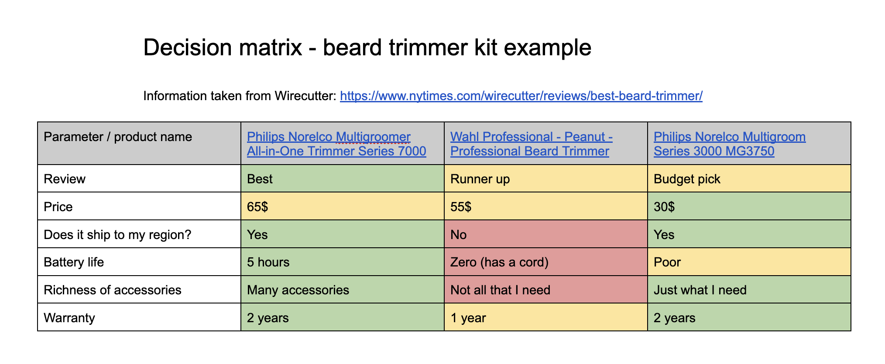
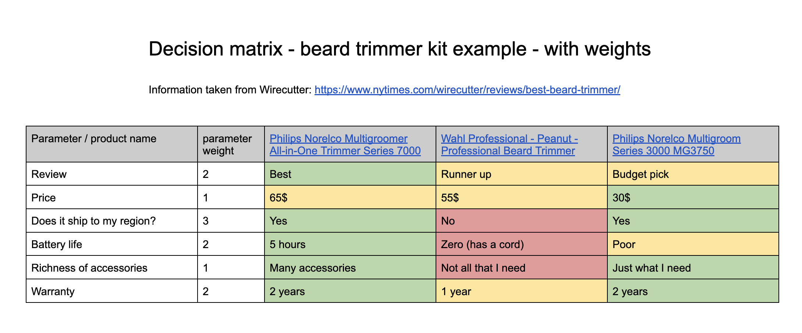

In our day to day, we make decisions all the time. Some decisions are more complex than others. A few months ago, I came across the concept of 'Decision Matrix', which I found very helpful to simplify the decision making process. I'd like to share why I use it, and how.

But first, credit goes to [Dedi Gadot](https://www.linkedin.com/in/dedi-gadot-49567328/) who shared the concept to me for the first time. In addition, Googling 'decision matrix' also brings up good resources, so don't take only my word for it.

## Why is decision making hard?

There are many reasons. In my mind, one of the things I struggle with the most is to find a rational, methodical way to weigh in on the different parameters of the decision. In my head, it's hard to find a good way to hold all the information at the same time.

## A decision matrix helps with that

After completing it, a decision matrix projects a multi-factor problem into a single-dimensional vector. My mind can easily grasp the color coding, and make a decision.

## The decision matrix framework

- Create a table
- Set the columns to be the different options
- Set the rows to be the different parameters or aspects by which you'll measure the decision
- For each cell in the table, color-code it by:
  - Green (good)
  - Yellow (okay)
  - Red (bad)
- After filling out all cells, take a step back and stare at the table. It might be possible to identify the best option.

## Example

Here's an example for a decision matrix. The doc is available [here](https://docs.google.com/document/d/18rLnBe0b4dAWqWTve4dJy_egJOpmOwciUQi95FaZ26w/preview).

In this example, you can see how I'm trying to decide on which beard trimmer to buy, based on recommendations from [wirecutter](https://www.nytimes.com/wirecutter/reviews/best-beard-trimmer/) as well as other, personal parameters. There are several options, several parameters - and everything is now color-coded in the table.

A quick look shows that the middle option is clearly rated lower than the other two. Another look shows that the leftmost option has only one yellow cell and the rightmost option has two.

I can easily make my decision now.

## Adding weights

A possible extension of the basic model is adding weights to the different parameters. This is to identify if a certain parameter is more important than others.

For example:

In this example you can see that I've identified some options which are more important than others. I can then multiply different cell-values with the weight to get a number for each option. Then, I can make a decision based on those numbers.

This isn't always necessary, but can be used as a potential tie-breaker.

## Identifying show-stoppers

Looking at the weight of the different options, you can see that I've set the weight of 'Does it ship to my region' to 3, the highest one.

I might as well have set it to 100. That parameter is a **show-stopper**. It's something that if isn't fulfilled - the option becomes irrelevant.

Sometimes, decision matrices can help with identifying show-stoppers, which helps eliminate options, making the decision even easier.
