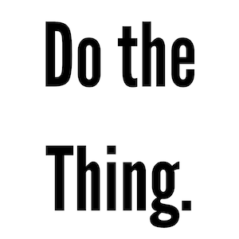

A few months ago, I listened to a podcast episode of 
[The Diary of a CEO](https://stevenbartlett.com/doac/) by Steven Bartlett. That
specific [episode](https://open.spotify.com/episode/6BnIBgAR439rdjOKZO1typ?si=DZrz1lGJSYWMYfYevYefmA&pi=CjkqnF9dTjy0b&nd=1&dlsi=83b82b546af14e72) 
was with [Alex Honnold](https://www.instagram.com/alexhonnold/), who's a
professional climber, and a very interesting person. I first got to know of him
by watching [Free Solo](https://films.nationalgeographic.com/free-solo) which
tells the story how Alex climbed [El
Capitan](https://en.wikipedia.org/wiki/El_Capitan) without any safety. 
I'm not a climber, but that movies was amazing to watch. I could feel my palms
sweat as I was watching it. I highly recommend. 

One of the special things about Alex, which was easy to see in the movie and
came across vividly in the podcast is how much he loves climbing - and how by
climbing day in and day out - he was able to improve on it. Regardless of
multiple reasons why he could have slowed down or even stop. 

"Do the thing" is a saying which Alex said repeatedly on the podcast, and I took
it to heart. I can think about it from two perspectives:

## First, the grind

In the book [Outliers](https://en.wikipedia.org/wiki/Outliers_(book)), Malcolm
Gladwell stated the 10,000 hour rule which says something like: the key to 
achieving world-class expertise in any skill, is, to a large extent, a matter 
of practicing the correct way, for a total of around 10,000 hours. (Quote taken
from Wikipedia). Whether the number should be 10,000 hours or something else -
it doesn't really matter. There's gradation to it. It's the **grind** of
practicing the thing again and again, day in and day out. 

## Second, the enjoyment

Probably the main contributor to Alex's ability to practice so much is the fact
that he just likes climbing. From what I understood, even when he's calculated
about how he trains, even when there are very hard things - he enjoys most of
it, even the hard parts. Combining enjoyment with the grind allows to persist
with 'doing the thing'. 

## My take

Years ago, when I was training in Martial Arts the sensei tried to convince the
students to attend a special training camp. He said (paraphrasing from Hebrew): 

> You could have 1000 reasons not to do something. But all you need is a single
> reason to do something.  
— <cite>Alon Ratzon</cite>

My take of the podcast episode is when I try and improve on something, I should
try and be consistent, and things will follow through. I should trust my
instincts, my desire, my self-criticism, seek help - but eventually - just keep
doing the thing.

