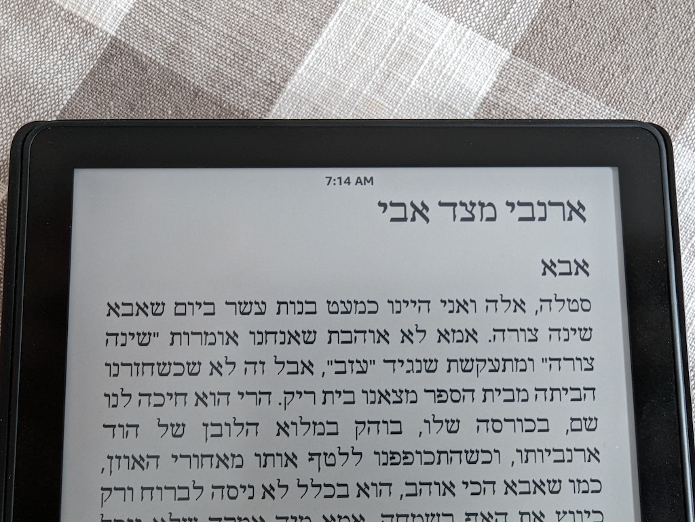
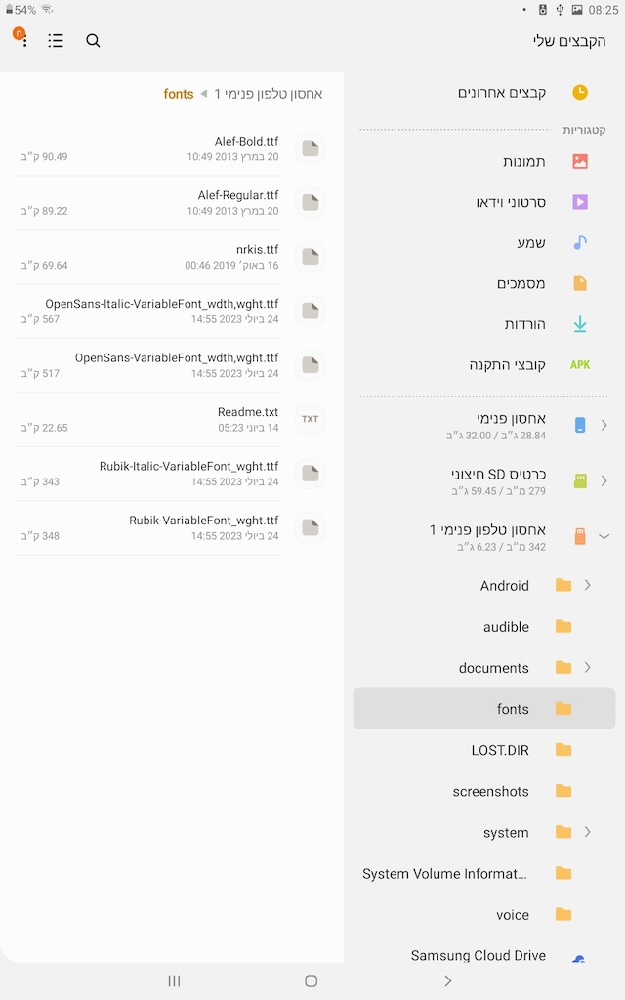
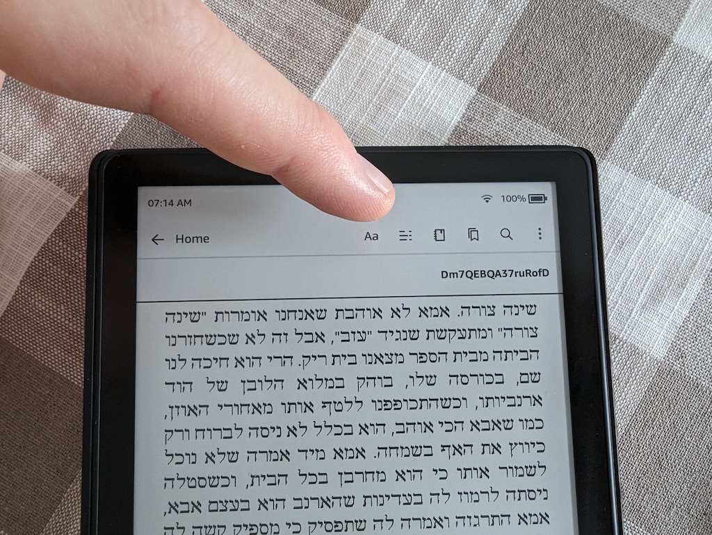
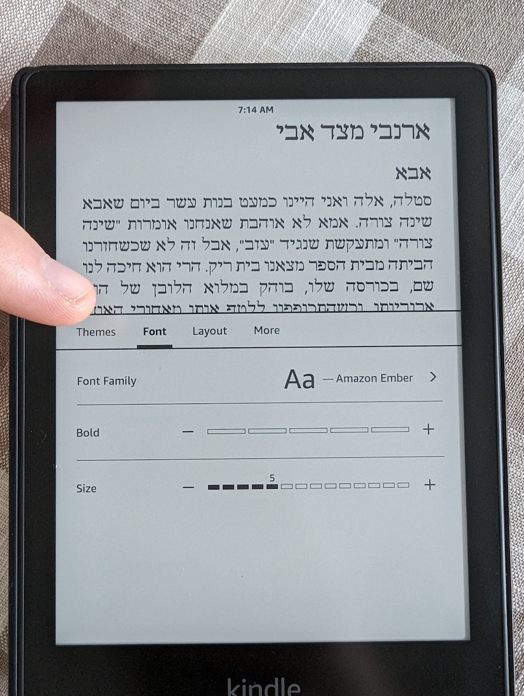
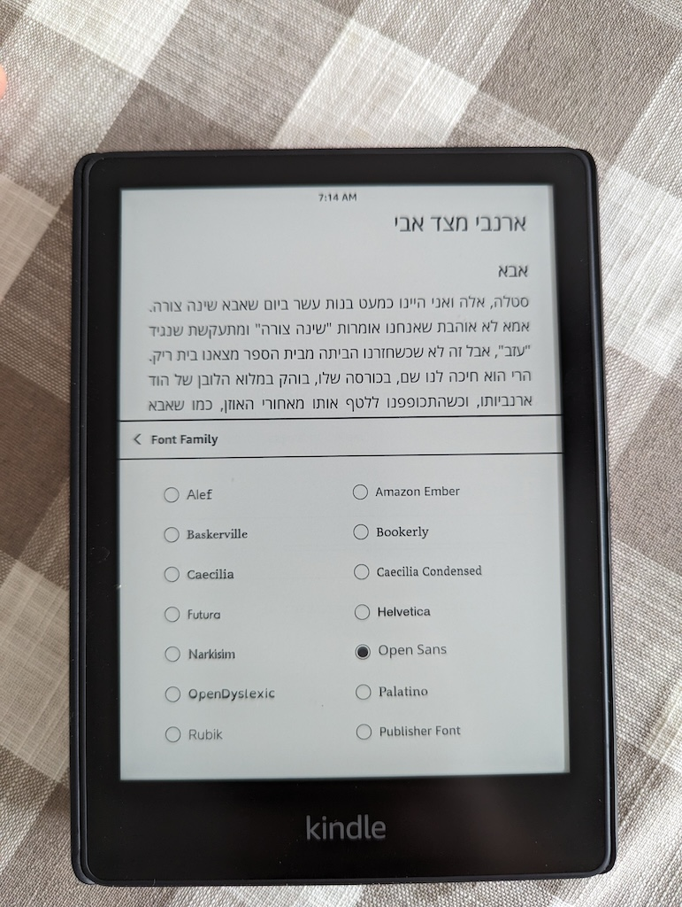
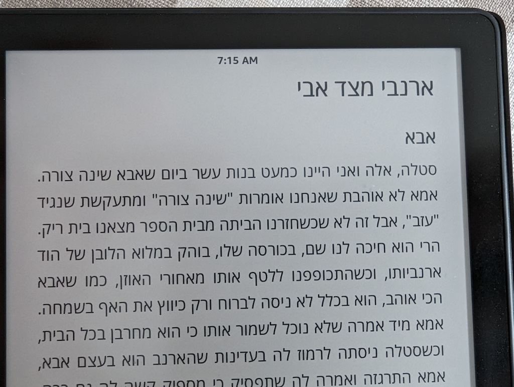

פונט ברירת המחדל בעברית שהגיע עם הקינדל שלי היה לא נוח לטעמי:

אחרי חיפוש בקבוצת הפייסבוק [קהילת קודש קינדל](https://www.facebook.com/groups/180912105377992) מצאתי חלקי הוראות, וחשבתי לכתוב מדריך עם תמונות שמסביר את התהליך.

ראשית, יש לחבר את הקינדל למחשב או טאבלט, כדי להוריד את הפונט החדש:

יש להוריד פונט חדש. אני אוהב את open sans, שניתן להוריד מאתר הפונטים של גוגל:

https://fonts.google.com/?subset=hebrew

מורידים למחשב, פותחים את קובץ ה-zip, ומחלצים את שני הקבצים הללו:

* OpenSans-Italic-VariableFont_wdth,wght.ttf
* OpenSans-VariableFont_wdth,wght.ttf

את הקבצים הללו, מעבירים לתיקיית fonts בקינדל:

לאחר מכן, מנתקים את הקינדל מהמחשב, ומשנים את הפונט בקינדל:
לחיצה בחלק העליון של הקינדל כדי לפתוח את התפריט, ולחיצה על האייקון של Aa

עוברים לטאב של font, ומשם בוחרים ב-font family:

משם, בוחרים את משפחת הפונטים שהורדתם:

וזהו - אחרי בחירה ב-open sans, ככה הקינדל שלי נראה:

בהצלחה!
