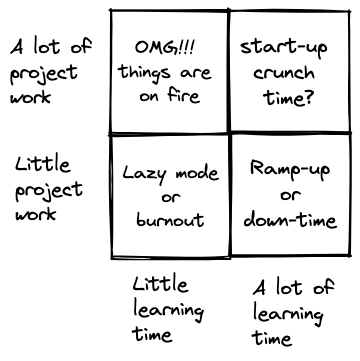

I enjoy learning very much. I'm not sure what is the origin of my last name (Lerner), but it may had to with one of my ancestors' profession, which was related to learning. Maybe. In any case, I enjoy it and I try to make up time for it. It doesn't always work out the way I want it to.

## Poor man's model for prioritizing learning vs. project work

(Chart made with the wonderful [Excalidraw](https://excalidraw.com/))

I thought about investing time in learning vs. investing time in project work, and tried to think in which situations it makes sense to be in each quadrant. Let's go over them. 

### *Lazy mode or burnout*

Ideally, you should **never** be in this quadrant. If you're lazy at work, you (probably) won't be able to maintain a good position. In my opinion, we should always be learning a new skill or improving an existing one. Don't take my word for it. The 7th habit in [The 7 Habits of Highly Effective People
](https://en.wikipedia.org/wiki/The_7_Habits_of_Highly_Effective_People) by Stephen Covey is 'sharpen the saw' - which means to improve one's skills.

If you're burnt-out, take care of yourself. You're probably not doing good to your employer, your peers, but most importantly, to yourself if you're still trying to do your normal work. Do what you can to take care of yourself. 

### *Ramp-up or down-time*

If you're optimizing for pure learning, this quadrant is a great place to be. When you're here, there is little expectation from you to deliver project work. This happens when ramping up on a new team. It's when you can ask a lot of questions, look under the hood of systems, browse esoteric parts of the codebase, and more. 

Another example of when I think it makes sense to be here is when the job market isn't doing so well, and you're out of a job. In this case, you could and try and get a job - but there aren't a lot of options. And in some cases, the options that do exist aren't what you really want. An option I'd like to suggest is to stay put, not apply for jobs - but rather prepare for the time it will make sense to start looking. Build (or refresh) your skill set - so you'll be in a better position once you decide to go job hunting. This idea isn't originally mine. I've read [Yair Zaslavsky](https://www.linkedin.com/in/zaslavsky/)'s posts about it.

### *Start up crunch time?*

I haven't been in this position, so this is a guess. I assume that there are cases in start-ups when you need to get something out the door, but you have no experience in doing it. Therefore, you need to learn fast and deliver faster.

I don't know about this one. I wouldn't want to suggest something I didn't experience myself, so take this with a grain of salt.

### *OMG!!! Things are on fire*

If you're handling an outage, or working on something which is super-urgent, you shouldn't be prioritizing learning. You should get that project work completes as soon as possible. Later on, when things calm down, it'll be easier to carve out time for learning.

## But, in reality...

That chart is nice, but trying to model this prioritization into a 2x2 matrix is not realistic. The reality is that there's a lot of gray between those four quadrants, and those should be navigated depending on the context. This is an attempt to create a model which will be used as the beginning of self-evaluating one's position. 

## Learning to enable others

There's a situation which I couldn't put into any of the quadrants. If you're a tech-lead, you need to be able to mentor and direct others. Sometimes, in an area you aren't familiar with. In order to do that, you should learn some theory, get your hands dirty with actually working on that area - and only then you'll be able to give valuable direction for others. 

I think this falls under the 'this is the job description' part, and should be happening from time to time - when the team starts to engage with new, unfamiliar areas. 

