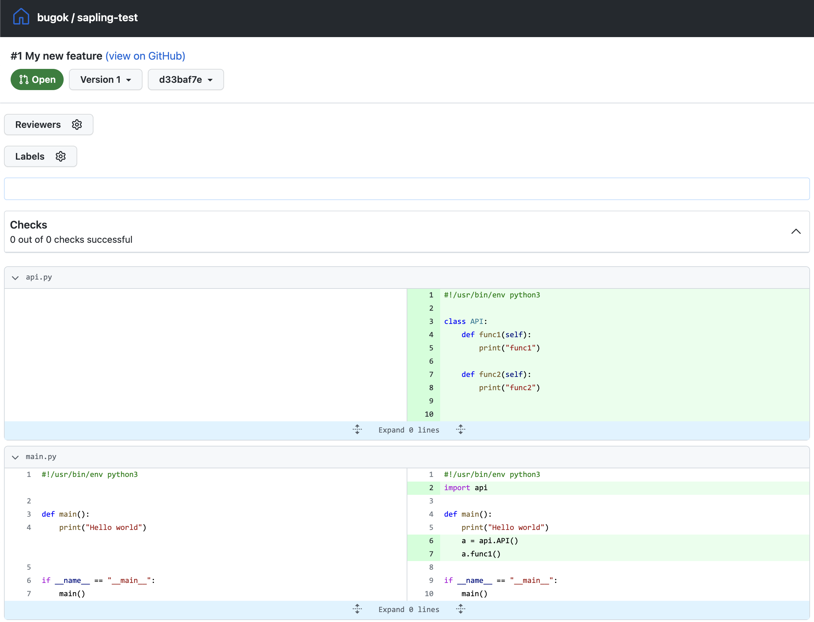

[Saping](https://sapling-scm.com/) is a:

> A Scalable, User-Friendly Source Control System

It's a fork of Mercurial, built internally at Meta. As I've been at Meta for 
over 10 years, I got used to using Mercurial. The ability of working with
stacked commits has changed the way I write code, and expect others to write
code. It helps break down a large feature into smaller chunks of code which are
easier to write, review and test.

I wanted to try how this looks using the public version of Sapling, so I gave it
a go: I created a new repo:
[https://github.com/bugok/sapling-test](https://github.com/bugok/sapling-test).
I cloned the repo by `sl clone https://github.com/bugok/sapling-test`, created 
a dummy first commit and pushed it directly using `sl push`.

To make the point about splitting a new feature to multiple commits, I created
three stacked commits:

```
0|[noamler@noamler-mbp]:~/sources/sapling-test (d33baf7ed)$ sl
  @  d33baf7ed  17 minutes ago  noamler
  │  Use API in main
  │
  o  87c8702c7  17 minutes ago  noamler
  │  Implement API
  │
  o  16f8a2060  20 minutes ago  noamler
╭─╯  API with NotImplementedError
│
o  e13acdffa  22 minutes ago  noamler  remote/main
│  Initial code commit, hello world
~
```

Following [this guide](https://sapling-scm.com/docs/git/intro), I ran `sl push
--to remote/my-new-feature`, which created this [pull
request](https://github.com/bugok/sapling-test/pull/1). Now, `sl ssl` I can see
that the local commits are linked to the pull request:
```
0|[noamler@noamler-mbp]:~/sources/sapling-test (d33baf7ed)$ sl ssl
  @  d33baf7ed  22 minutes ago  noamler  remote/my-new-feature
  │  Use API in main
  │
  o  87c8702c7  22 minutes ago  noamler
  │  Implement API
  │
  o  16f8a2060  26 minutes ago  noamler
╭─╯  API with NotImplementedError
│
o  e13acdffa  28 minutes ago  noamler  remote/main
│  Initial code commit, hello world
~
```
(See the text next to the top commit)

Unfortunately, GitHub doesn't show the different commits, but that's where
[ReviewStack](https://sapling-scm.com/docs/addons/reviewstack/) comes into play.
Loading
[https://reviewstack.dev/bugok/sapling-test/pull/1](https://reviewstack.dev/bugok/sapling-test/pull/1)
Shows the following:

I can see only the changes of the first commit:


I can see the changes from the second to the third commit:


I can see all the changes together:


After poking around ReviewStack, I eventually merged the pull request. Then, I
ran `sl pull` to get the changed locally, and ran `sl` to see how my local repo
looks:
```
0|[noamler@noamler-mbp]:~/sources/sapling-test (d33baf7ed)$ sl
o    32ac678d0  77 seconds ago  remote/main
├─╮
│ │
│ ~
│
@  d33baf7ed  39 minutes ago  noamler  remote/my-new-feature
│  Use API in main
~
```

`sl log` shows all three commits - which is helpful to later see how the
different parts of the "feature" were implemented. It also makes it easier to
revert parts of the feature, if needed.

And now, on to the next feature.
