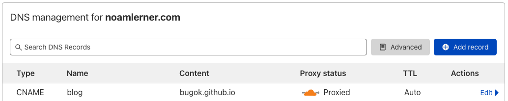
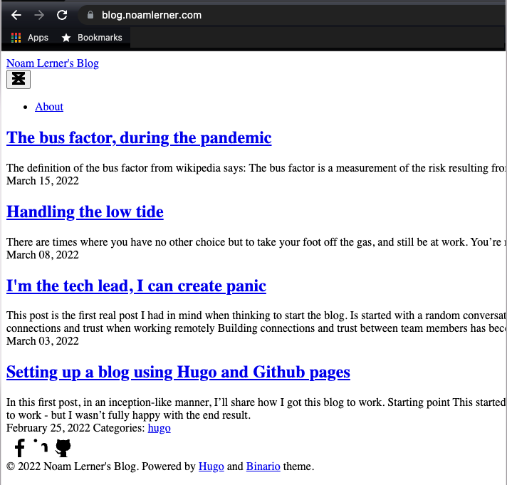
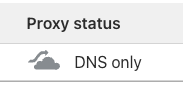
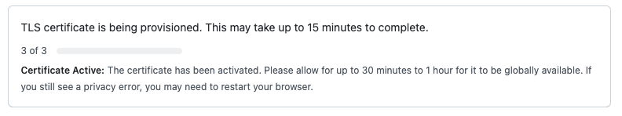
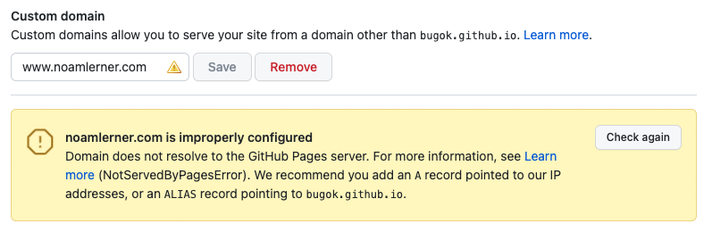
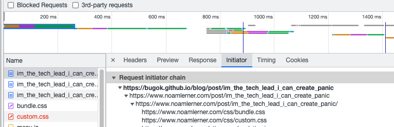
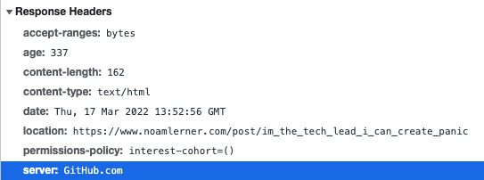

In the last few days, I had to take some sick time from work and attend to my kids who are at home while my wife isn't feeling well. After spending all day running after them, I needed to unwind at the evening. I played some [Eleven Table Tennis](https://www.oculus.com/experiences/quest/1995434190525828/) and then went to play around with creating a custom domain for the blog, instead of having it being served from `bugok.github.io`. 

## But why? 

Things are working fine with the `github.io` domain, I also don't expect the blog to have a lot of volume. This was purely an exercise to make this work. One of the reasons for this is to see if I can make things work in the 'real-world'. I've spent over 8 years working for Facebook/Meta - so I wonder how things are working outside of that infrastructure.

## Getting started

First, I had to buy a domain. I didn't think about this much, but Googling some options, I came across [cloudflare](https://www.cloudflare.com/) which was recommended by people I've worked with. Also, I've remembered reading [a good blog post of theirs](https://blog.cloudflare.com/october-2021-facebook-outage/) about Facebook's outage from October 2021. That made me think highly of cloudflare's technical competence. 

I signed up for the free plan, bought the noamlerner.com domain, and started to tinker with it. 

### Handling the sub-domain and path

When thinking about where I want to blog to be, I had `blog.noamlerner.com` in mind. Also, when configuring the blog for `github.io`, I used the `/blog` path, in case I'd like to deploy multiple sites to the same `bugok.github.io` subdomain. The latter made things a bit harder to configure. 

Started off with setting a `CNAME` entry for `blog.noamlerner.com` in cloudflare: 
. 

Then, I configured the custom domain in the github pages settings to be `blog.noamlerner.com`. Eventually, I got this: 


Obviously, something is working, but some things aren't. The static content isn't available. As a friend recommended, I launched Chrome's developer tools and started poking around. I found that images weren't rendering properly, because they weren't in the right place (I manually changed the the paths to make sure).

Eventually, I decided to move away from having the `/blog` path, and committed [this commit](https://github.com/bugok/blog/commit/d9c2f31f0bfae657d4f2c6ddbd16c5cc045c016f) to change `baseurl = "https://bugok.github.io/blog/"` to `baseurl = "https://bugok.github.io/"` in my hugo `config.toml`. Now the blog is at the root of the website. The new domain isn't working, but at least it'll be easier to debug. Also, I've decided to put the blog under `www.noamlerner.com`.

### SSL - removing cloudflare's https option

Github pages has an 'enforce https' option, which was disabled for me. I wanted to make sure that traffic to my domain will be https by default. I essentially needed to make my cloudflare configuration as simple as possible.

When I started playing with cloudflare, I got a suggestion to enable [Always Use HTTPS](https://developers.cloudflare.com/ssl/edge-certificates/additional-options/always-use-https/). Seems like a good idea, but this, I believe, threw off github's HTTPS configuration, so I removed that. 

### SSL - removing cloudflare's proxy

Next, I removed the cloudflare proxy. As you can see in the previous screenshot from cloudflare, the default of the DNS entry is to have 'proxy status' be enabled. The [proxy status documentation page](https://developers.cloudflare.com/dns/manage-dns-records/reference/proxied-dns-records/) specifies: 

> When you proxy an A, AAAA, or CNAME DNS record for your application (also known as orange-clouding), DNS queries for these records will resolve to Cloudflare Anycast IPs instead of their original DNS target.
>
> This means that all requests intended for proxied hostnames will go to Cloudflare first and then be forwarded to your origin server. This behavior allows Cloudflare to optimize, cache, and protect all requests for your application.

Of course, we all want optimizations, cache and protection for our website - but only if they are working. Therefore, I've removed the proxying: 



Looking at the output of dig, I saw what I was expecting:
```
$ dig www.noamlerner.com +nostats +nocomments +nocmd

; <<>> DiG 9.10.6 <<>> www.noamlerner.com +nostats +nocomments +nocmd
;; global options: +cmd
;www.noamlerner.com.		IN	A
www.noamlerner.com.	300	IN	CNAME	bugok.github.io.
bugok.github.io.	3093	IN	A	185.199.109.153
bugok.github.io.	3093	IN	A	185.199.108.153
bugok.github.io.	3093	IN	A	185.199.111.153
bugok.github.io.	3093	IN	A	185.199.110.153
```

Before disabling the proxy, `www.noamlerner.com` was pointing to a cloudflare server.

Lastly, I went back to the github pages settings page, and saw this: 
.

And a little while after - I got this nice clean lock in Chrome: 


### DNS - setting an entry for the root domain

Getting SSL to work required some DNS and at this point, everything seemed to be working for the blog. However, the github pages settings page had a complaint that the custom domain is improperly configured: 



Again, Googling a bit, I couldn't find something which adds up. When following the [github subdomain guide](https://docs.github.com/en/pages/configuring-a-custom-domain-for-your-github-pages-site/managing-a-custom-domain-for-your-github-pages-site#configuring-a-subdomain), I did everything it says I should do.

Eventually, it clicked. The warning isn't for `www.noamlerner.com`, but for `noamlerner.com`. This corresponded with Cloudflare having a warning at the top of their console about me not having a DNS entry for the root domain. I've added another CNAME for `noamlerner.com` to resolve to `bugok.github.io`, and a few seconds later - github was happy: 


### DNS - CNAME with github actions

When setting a custom domain for github pages, what happens is that a file named `CNAME` is created with the content of the domain. I guess github is looking for that file to configure some things. When I was experimenting with getting this to work, I found that the custom domain and the `CNAME` file were removed. 

Turns out when deploying a new version of my github pages site, the github actions I have configured remove everything from the `gh-pages` branch (which is the branch deployed to github pages) before publishing a new version of the site. This meant that my manually configured `CNAME` file was getting removed on every `git push`. In order to fix that, I tried: 
- Pushing a `CNAME` file to the `main` branch (didn't help)
- Create another action to create the file (didn't work)

What did work, is to read the manual, and see that the action I used to publish my hugo site to github pages ([peaceiris/actions-gh-pages](https://github.com/peaceiris/actions-gh-pages#%EF%B8%8F-add-cname-file-cname)) has a `cname` option to create that `CNAME` file with the right content. [This commit](https://github.com/bugok/blog/commit/d78ac8613dbefac1e145619a27ecae8a9f2e9e38) solved the issue.

### Backwards compatibility of `/blog`

But what happens if the millions of people who have the `bugok.github.io/blog` already bookmarked? How do I prevent them from getting errors and allowing them access to my new domain? Turns out, that going to `bugok.github.io/blog` resolves to `www.noamlerner.com`. But how?

Opening up the network tab in chrome developer tools, I saw this:


Then, looking at the first response headers: 



### Finally

The blog is working, served from noamlerner.com, using a github repository, github actions which push to github pages, which is fronted by cloudflare.
