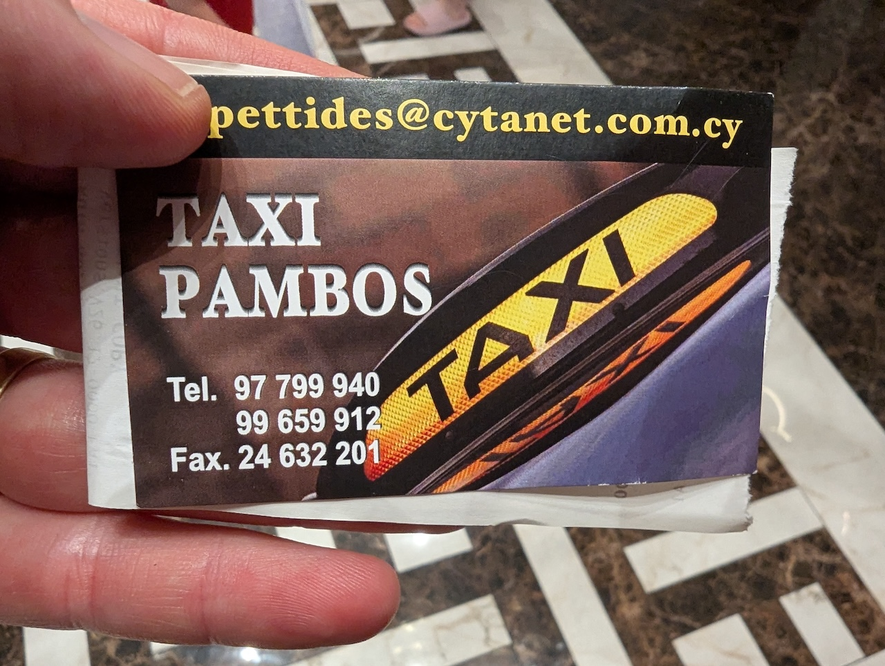
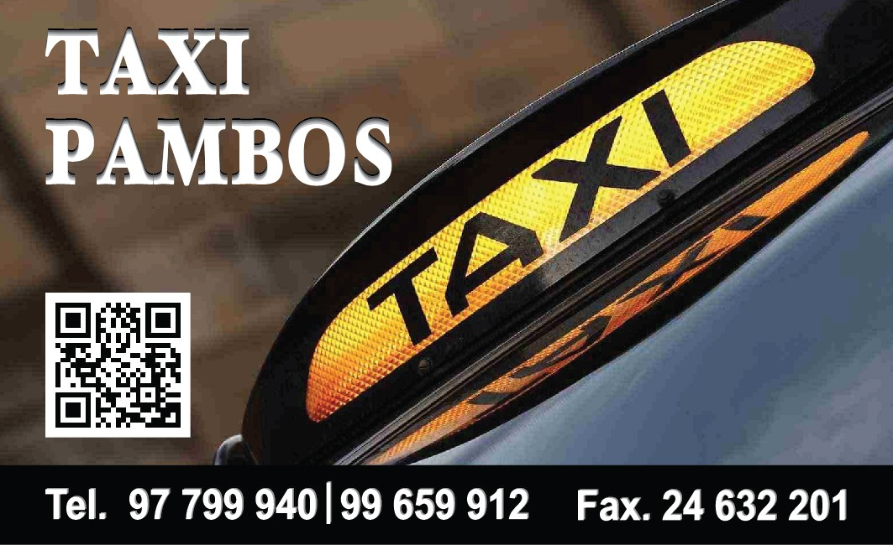
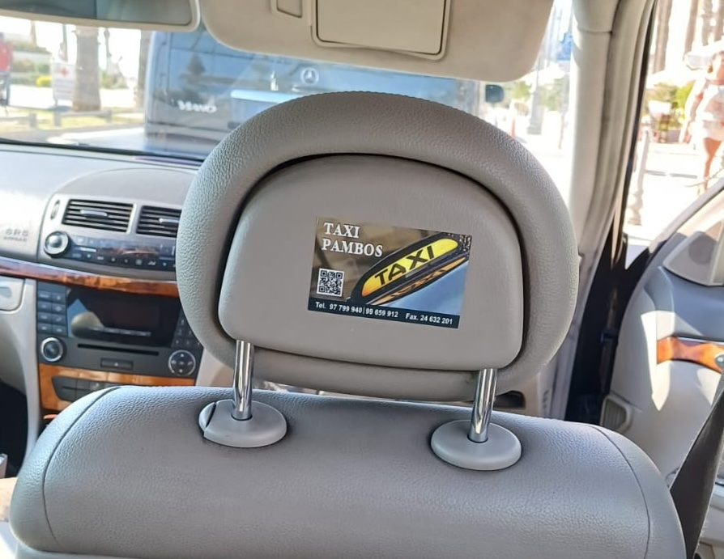

During August, I took a family vacation in Cyprus. When we landed, the taxi
driver presented me with his business card, offering me a deal: If I contact him
a day before my return, he'll give me a 15 Euro discount on the fair back to the airport.

Here's his business card:

The taxi driver, Pambos, says that that one of the numbers is a WhatsApp number.

I kept thinking how this isn't an easy way for me to remember the number. But, I took out my phone, copied the number to my contacts, and indeed, contacted him a day before my return.

On the ride back, I had the idea to make it better. I thought that if there was
a QR code which could use WhatsApp's API to pre-fill a message and send it to
the driver - it would make the process much easier.

Googling a bit, I found https://create.wa.link/, which did exactly that. I
created a short link with a pre-filled message, linked it to the driver's number
and even got a QR code.

When we arrived at the airport, I used my wife's phone to scan the QR code - and
send a WhatsApp message from my wife's phone.
The taxi driver was amazed. I sent him the QR code image and the link - and
suggested that he should put the QR code on his business card.

A few weeks later, I get this image from the taxi driver:

He did it! A few days after that - I get this image:

He printed it and stuck it on the back of the headrest - so customers could scan
it!

I wished him that he'll get more customers with this. He replied and said that
even though it has been two days - he already had customers use it - and it got
him more rides.

Success!
