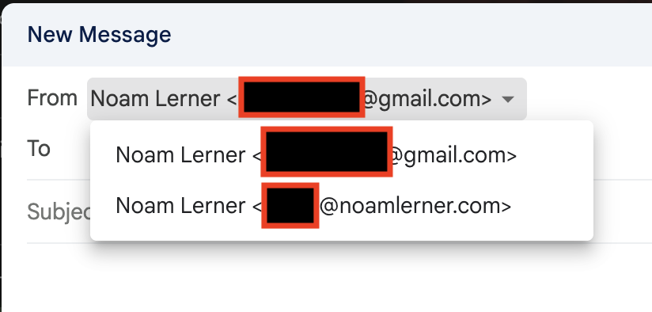

A few weeks ago (so not really a Today I learned) I wanted to see if I could get
an email address using my domain. Turns out I can - and someone already built
the guide for that:

https://dev.to/moefqy/set-up-free-custom-domain-email-using-cloudflare-38ea

There were additional DNS tweaks I needed to do in order to get it working:

I changed my `_dmark` TXT entry to:

```
"v=DMARC1; p=none; asp=r; adkim=r;"
```

and hanged a root TXT entry to
```
"v=spf1 include:_spf.mx.cloudflare.net include:_spf.google.com ~all"
```

to include the Google spf address. 

Then - I was able to use my custom email address from the gmail app / website
seamlessly.

The end result is something like this:



Gmail allows to pick from which email address to send the emails from.
Similarly, emails received to that configured address will show up in the inbox. 
